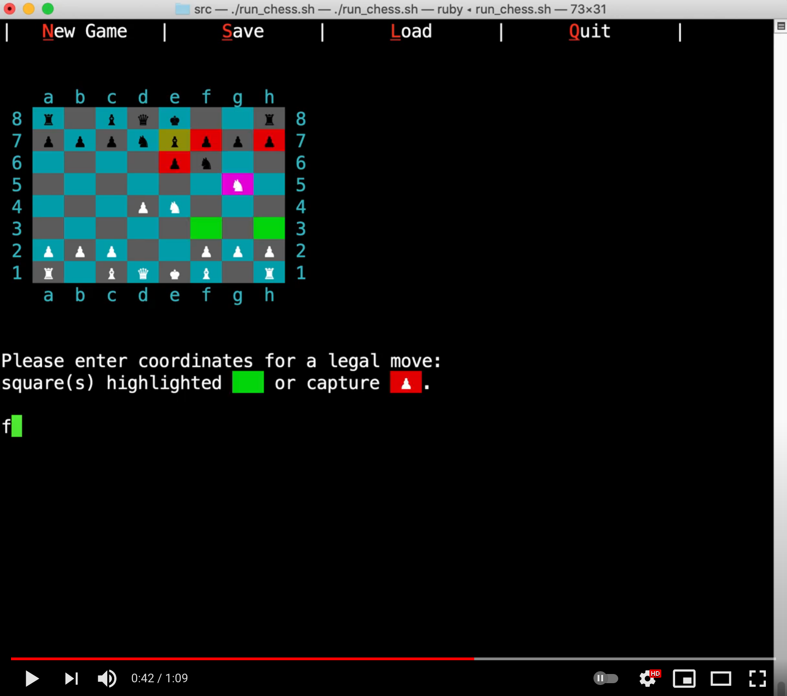

# CLI Ruby Chess App

<!-- [app-demo](./docs/App_Demo.mov) -->

<object>
<iframe width="560" height="315" src="https://www.youtube.com/embed/OSoTdzJMeSY" title="YouTube video player" frameborder="0" allow="accelerometer; autoplay; clipboard-write; encrypted-media; gyroscope; picture-in-picture" allowfullscreen></iframe>
</object>
## Demo

<!--  -->
