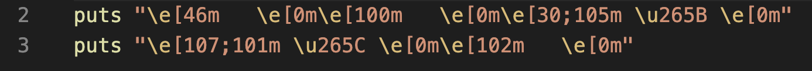
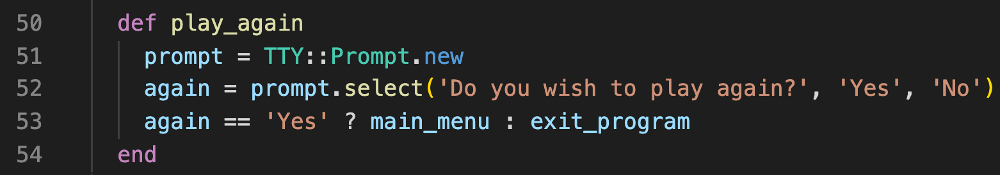

# CLI Ruby Chess App
#### Demo


#### GitHub Repository
[https://github.com/Nam-fullstack/terminal-chess](https://github.com/Nam-fullstack/terminal-chess)
### Minimum Requirements
- **Ruby v2.7.2**
- **Bundler v2.2.18**
- 4G RAM
- Windows 7 or later, Mac OS X Mavericks 10.9.5, Linux Ubuntu 14  

To install Ruby, please view and follow these [instructions](https://www.ruby-lang.org/en/documentation/installation/)

To install Bundler, run
**`gem install bundler`**

### Installation
- Clone this repository [instructions](https://docs.github.com/en/github/creating-cloning-and-archiving-repositories/cloning-a-repository-from-github/cloning-a-repository)

- Alternatively, you can download the zip file from this repository.

Navigate to the **/src** folder directory from your root directory in your Terminal or Command Line.
- **`cd src`**
- Run **`bundle install`**

Ensure you have the following ruby gems successfully installed on your machine before running the application:

- colorize v0.8.1
- tty-prompt v0.23.1
- tty-progressbar v0.18.2

This application depends on these Ruby gems. For Mac users, bundler will download and install these dependencies automatically for you. For Windows and Linux OS users, refer for the website link below for instructions on how to download and install Ruby Gems:
[https://rubygems.org/pages/download](https://rubygems.org/pages/download)

This application was built on Ruby version 2.7.2, you may run into some potential issues if your machine is running an older version of Ruby below version 2.5. To update to the latest version, please view the [ruby documentation](https://www.ruby-lang.org/en/documentation/installation/) on how to do so.

To check what version of ruby you are running:

- run **`ruby -v`** or **`lib/main.rb -i`** from the src directory

You can also run lib/main.rb -h to display help message. Possible flags included are shown below, these provide info on how the save/load functions work, what directory you have to be in, requirements in order to run the program etc.:

- *-help* or *--help* or *-h*
- *-info* or *--info* or *-i*
- *-list* or *--list* or *-l*
- *-load* or *--load*
- *-path* or *--path* or *-p*
- *-requirements* or *--requirements* or *-req* or *-r*
- *-save* or *--save* or *-s*

### Windows OS

To ensure correct display of chess characters, please ensure that you set your Command Line font to one of these recommended fonts:

- Arial Unicode MS
- Free Serif

Alternatively, you can [visit this webpage](http://www.alanwood.net/unicode/miscellaneous_symbols.html) and select fonts listed for windows and see if you're able to view the chess pieces in the left column. Press Ctrl + F and type in "chess" to quickly navigate to the relevant section.  

## To Play

Once navigated to **/src** folder in Terminal or Command Line:

- 1) Run **`chmod +x run_chess.sh`**
- 2) Run **`./run_chess.sh`**
- Alternatively, you can run **`ruby lib/main.rb`**
<br>

- To start a game, simply select:
    - Two Player Game OR
    - One Player Game (to play against computer)

For instructions on how to play the game, select **How to Play** from the MAIN MENU options. For full breakdown of rules and how to play the game of chess, please [view this video](https://www.youtube.com/watch?v=fKxG8KjH1Qg)


<br>

You can also **save** the progress of a game at any time and resume that game later by selecting **Load Game** from the MAIN MENU options and selecting the corresponding number for the game file.


Enter '**s**' to save
<br>


To Load a game, select **Load Game** from MAIN MENU
<br>


Enter corresponding number for game, i.e. '**1**'
<br>

# Software Development Plan

### Purpose and Scope of application

This a terminal application to play Chess developed using Ruby programming language. Chess is a globally played game and bypasses language barriers. Chess is a complex game comprising of 32 pieces with countless variations and possibilities. The objective of the game is to checkmate the opponent's King.

The decision to create a terminal chess application was mainly based upon the intention of improving my learning and deepening my understanding of the Ruby programming language and Command Line. I wanted to make the game visually appealing and have features that would make it easier for user interaction. One such feature is to have a piece's possible moves and captures highlighted green and red, respectively. Having this feature would broaden the target audience as not everyone is a professional chess player, and would visually help aid them select their moves. I was looking into getting click input in terminal, but came to the conclusion that it wasn't possible. This would have been the ideal case for user interaction as anyone can use this app. Plan B was to get user to select the piece/square they wanted with the arrow keys and enter, however, to navigate the board each time for a move was quite a cumbersome task.

So that left me with option C, which was to get the user to type in the coordinates using chess notation. As the full chess notation for both steps would make using the application considerably harder for inexperienced chess players. For example, if the player wanted to move the knight on b1 to the f3 square, they would have to input b1f3. Even the use of such nomenclature is rather difficult for a seasoned chess player. Rather than using the full algebraic notation, I opted to breakdown each player's turn into 2 steps, selecting the piece they wish to move and then selecting where they want the piece to move. Doing so would also enable the feature to display highlighted squares for possible moves.

The target audience for this application is for anyone that wants to play chess in terminal, and also the educators and fellow students at Coder Academy. It is also intended to be used as a reference or resource for anyone that is interested in creating and designing a CLI application.

I used Trello to monitor and develop an implementation plan for all the features, game mechanics, piece move mechanics, logic for extra special movement features (castling, en passant, pawn promotion), planning and research on various gems and how to do things.

### What the Application will do

Once a game has started, it will print an (8 x 8) chess board  to the terminal window, with alternating colours, just like a real chess board. It will have all the pieces at all their starting positions (refer to Figure1.0 below). Each player has 1 turn and alternates, with white making the first move.


**Figure1.0 Start board position**
<br>

The application has all piece movement and capture functionality working as per rules of the game. Special movements like castling, en passant and pawn promotion are fully functional. The game ends when checkmate or stalemate is achieved, when either player has no more legal moves, and the King is under check for checkmate, or not under check, resulting in a stalemate aka draw. As the is a never-ending loop, the game Main Menu will always loop through and the user will be returned to the Main Menu to select what they wish to do from there with various prompts in between for them to decide if they want to Quit/Resign the game, Play Again, Return to the Main Menu, or Exit the Program.

### How user will use it

Once loaded, the user is prompted for the game mode in which they wish to play, 1 player or 2 player. Each player's turn is broken up into 2 steps.

**1)** User selects piece they wish to move by entering in its coordinates, i.e. e2

**2)** User selects the location in which they wish to move the selected piece, squares valid moves or captures will be highlighted in green and red, respectively.

At any time during the game, the user my opt to Start a **New Game**, **Save** the current game, **Load** a game or **Quit**. These options will be displayed at the top of the screen.

# Features

### Feature 1

One of the main features I wanted to implement was having different square highlighted in various colours based on their possible moves, possible captures, previous piece that moved, active piece selected. This just really helps make gameplay for the user substantially easier with these visual cues.


As you can see in the diagram above, the selected active piece is the Queen, highlighted in magenta. The possible moves are highlighted in green, and the possible captures are highlighted in red. The previous piece that moved (white King) highlighted in yellow.

The logic behind the color selection for the squares is outline in the code snippet below:


Below is a random example of how the ANSI escape codes are used to print out the desired output for the different square colours, the pieces, and piece colors:



This is a visual diagram representation to illustrate how ANSI escape codes work:


To display the chess pieces in terminal, these are simply just a special unicode character, so it behaves like text. Please refer to this website as a [reference](https://unicode-table.com/en/sets/chess-symbols/).

### Feature 2: Single Player (vs Computer)

To select this feature, the user selects Single Player mode from the MAIN MENU. Player defaults to playing as white. A play as black feature may be added in the future. The principle logic behind this feature is randomly selecting a black piece with valid moves/captures and then randomly selecting a move or capture using #sample. Logic behind how this is done is to get all of the piece coordinate data from the Board and then flattening it and get rid of all the 'nil' coordinates for positions that don't have any pieces in it with the #compact method. Then it iterates over every piece, determines and only selects if the piece has any moves or any captures based on it's color being black.


Line 101 skips any pieces that are not black. So you get just the black pieces that have valid moves or captures. Then it randomly selects a piece using the #sample method and returns it's location hash. This selects the active piece to be moved.

Then a random move or capture is selected, and then returns the location hash for the move. Then the board is updated with the move and removes the original piece, removes the captured piece if it's a capture, and creates a new instance of that piece at the new location.


### Feature 3: Load and Save Game

Originally I was intending to save games to .txt format by converting the entire board and piece attributes to string.Then decided that it would be much more conventional to use JSON, or even better, YAML, which is essentially the css sass equivalent, doesn't require any curly braces, just simple nested indentation for assignment. 

I then stumbled across an even more efficient method using Ruby's built-in Marshal module. It serializes the data using the Marshal.dump method, which transforms a data structure into a binary string, which can be written to a file. As we aren't manipulating any of the data or using it with any other programming languages, the readability of the serialized data doesn't really matter. To reconstitute the data or deserialize, we just use the Marshal.load method. [This website](https://blog.appsignal.com/2019/03/26/object-marshalling-in-ruby.html) explains in more detail, with examples of how Marshalling works in Ruby.


To save a game, we first make a directory, saved_games, unless it already exists. Then we create a filename with the following format: Chess YYYY-MM-DD and HH:MM:SS. Open up the file and dumps (serializes all the object data) to the file using Marshal.dump. 
<br>


Essentially, to load a saved game, we just open it and deserialize the data using Ruby's in-built Marshal.load method. To select which game to load, we first have to create a list, game_list[ ], and in the saved_games directory, if any filenames contain Chess in their name, it pushes that file to the game_list array. If there are no saved games, then it will output, "There are no saved games to play yet!", otherwise, it will print to the screen a list of the saved games.
<br>


Prints out each saved game with it's index value (+1) and it's filename.
User is prompted to select a game to load based on its file number (index), input is converted into an integer, and only returns the input for the filenumber if it's between 1 and save_games.size. If it is outside of this range, then prompts user to input a valid file number and calls the method again, so loops until it returns a number that is in the correct range of number of files that exist.
### Feature 4: ASCII Banner Art

I wanted to have a landing banner art that was next level and something that people have never really seen before in Terminal Apps. Generating ASCII Text art was common practise and nothing new. I actually wanted to add some graphics or load an image. However, such a thing doesn't exist as Terminal isn't a graphical interface, but rather, a text based one. However, I did stumble across a website where it converts and image into ANSI text and essentially displays that image as best as it can with characters and use of ANSI text color and background colours to achieve the desired effect - a visual representation of an image using text characters. The website I used to generate the ANSI text file was
[https://www.ascii-art-generator.org/](https://www.ascii-art-generator.org/)


Images below 300 characters (1 character is equivalent to a pixel for the image), would be quite pixelated, for lack of a better term, and wouldn't display the image as well having streaks of black between lines as pixel density was too high to translate into 300 characters per row. The second drawback of having this banner art is that to display it correctly, the terminal window would have to be over 350 characters wide, and over 150 characters in height. Essentially full screen on a 15" laptop would still result in bands appearing due to the "text wrapping" nature of terminal.

More importantly, when it came to playing the Chess game, the board and text was so small it was unfeasible to even play unless the user decided to zoom in substantially to make it bigger on the display. So I decided to just leave this banner art feature out and if educators wish to showcase what cool things you can do, then they can simply just uncomment line 57 in main.rb
`display_ansi`


#### Other features

Other features include having each piece being able to have it's own individual movement mechanics and capture mechanics. Special movements exist for specific pieces, such as:

##### Castling

Where a King and Rook can castle given that the following conditions are true:
- King hasn't moved
- Castling Rook hasn't moved
- There are no pieces in between the King and Rook
- The King isn't castling out of check, through check or into check.

##### En Passant 

Where a Pawn on the 5th rank (4th for black) can capture an adjacent pawn that has advanced 2 squares, bypassing it's capture square, in which it is eligible to capture the pawn, in passing only on the next turn.

##### Pawn Promotion

Where a Pawn can be promoted to a Queen, Rook, Knight or Bishop once it has reached the 8th Rank (1st Rank for Black). 

Please refer to Move Mechanics section of the **Slide Deck.pdf** in **/ppt** for illustrations and additional explanation of all move mechanics.

**Other important features of the game that are functional:**
- Check
- Checkmate
- Stalemate

## Error Handling

If the user enters an invalid coordinate, anything that's not between [a-h] and [1-8], then it will **raise an InputError**, prompting the user to enter a letter [a-h] and number [1-8].


<br>

If the user selects a blank square or opponent's piece, it will **raise a CoordinatesError**, prompting the user to enter the file and rank of a piece that is their color.

<br>

If the user selects a non-valid move for the selected piece, it will **raise a MoveError**, prompting them to enter a valid move.

<br>

If the selected piece has no legal moves, it will **raise a PieceError** and will prompt user that the selected piece has no legal moves and to select another piece.

<br>

When loading a saved game, if the user selects a file number value that is not listed, it will prompt the user of an input error, and tell them to enter in a valid file number.

<br>

If there are no saved games, it will inform the user that there a no saved games to play.

<br>

If there is an issue with opening/loading a saved file (**IOError**), it will print to the screen:
```ruby
puts "Error while loading #{filename}"
```

If there is an issue with saving a game (**SystemCallError**), it will print to the screen:
```Ruby
puts "Error while writing to file #{filename}."
```
<br>

If for whatever reason there is any other error(s) that arise, there is a 'global/master rescue clause' to catch those errors.


<br>

Outlined below are all the custom Error Classes that have been defined, they're all sub-classes of StandardError such that a single StandardError rescue clause can be used to catch them all.


<br>

For all the defined Error Classes, these are rescued when they arise during each turn for the 2 steps for user input and keeps repeating until they enter a valid input for piece selection and move selection:


<br>

Below is the logic and code for the error validation unless it matches specified regex, correct piece color, matches a valid move, piece selection based on King's safety.

<br>

## Implementation Plan

##### Trello


[https://trello.com/b/rjvP3IhQ/terminal-app](https://trello.com/b/rjvP3IhQ/terminal-app)
Trello project management tool was used for all the planning, research, task prioritization and deadlines. Tasks are labelled with essentials (if it's an Important, Core function or a Nice to have/Sprinkle), difficulty (easy, medium, high or extreme)

### Flow Diagrams


## Testing

Majority of the testing was TDD and manual testing as it was rather difficult to test scenarios or specific case situations.

Below are RSpec tests that I ran to test the core functionality of the application:

- the board and all its pieces initialize correctly in the right positions
- conversion of the chess notation input into the corresponding coordinates
- saving and loading functions were working properly

 
 
 

 For more examples of manual testing, please refer to the Manual Testing slides in my **Slide Deck.pdf** in the **/ppt** directory.

## Use of Ruby Gems


TTY Progressbar, customized loading bar, added percentage, width of bar, and customized loading speed, number of steps for each advance.
<br>


Colorize mixed usage with string concatenation and interpolation
<br>


Colorize
<br>


TTY-prompt using hash, value outputting the integer value for usage in the case statements in main menu.
<br>


TTY-prompt select, using ternary operator to call methods
<br>


TTY-prompt during game if user enters Q to quit, prompts if they're sure they want to quit, and calls another prompt if to ask if they want to play again or continue playing the game if they choose no.
<br>


TTY-prompt for play_again method, asks if user wants to play again, and ternary operator to return to main menu or another prompt if they want to exit the program.
<br>


TTY-prompt, asks the user one last time to confirm if they're sure if they want to exit the program. Using ternary operator to call quit_app and main_menu methods.
<br>


Used this AMAZING GEM, it literally is a gem, as a linter to get rid of any unnecessary trailing white space of incorrect indentation spacing (default 4 spaces instead of the conventional 2 spaces). Among a whole bunch of other formatting convention correctionss that it makes. Besides from the indentation and whitespace, I was already incorporating AirBnB best practises for essentially 95% of my code, just didn't know that it was convention to have a new line at the end of the code and also a new line after a guard clause (i.e. break or next). Above is the custom YAML configuration file so that it would exclude specified parameters when it performs autocorrect funtionality to format all the code.

Majority of these corrections were from indentation (+450), and substantial amount was from line length being too long, and quite a few method blocks and Classes having too many lines.

# Future Developments

- Feature for player to Play as Black
- Importing an API or self-learning AI chess engine such as Stockfish or Alphazero to play as computer rather than just randomly selecting a piece and move. These engines access a large database of openings and also calculate the best winning move for each turn.
- Clock/Timed Games feature, like lightning, blitz, or bullet chess where both players have various time limits each on the clock (i.e.1 min total). Having Fischer and Standard modes would definitely be a must too.
- Due to time constraints, I was going to have a feature where it would print the moves played in Figurine Algebraic Notation (FAN), i.e. ♞c6 instead of Nc6 or ♖xg4 instead of Rxg4. As this would make it more standardized internationally as letters for Knights, Rooks, Bishops, Queen, King may vary from language to language.
- Having 3-fold repetition and 50-move stalemate features implemented would actually make the game complete in its entirity. I actually did plan to implement these, but doing so is considered to be extremely difficult, time constraints simply didn't enable me to. I did actually figure out logically how I would do so for both. 3-fold repetition, Marshal dump the board each turn, and would need to check if the same board position has occurred 3 times, if any pieces have been captured or has it's @moved attribute changed to true, then clears dumped boards as these are actually technically considered as a new/different position and wouldn't take up a bunch of memory. 50 move stalemate, once there are no more pawns, Pawn.all? = nil, start a move counter, once move counter reaches 50, declares Stalemate/Draw.
